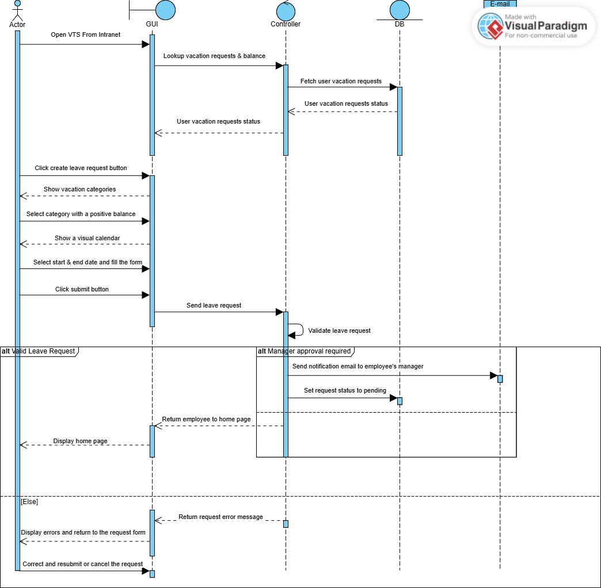
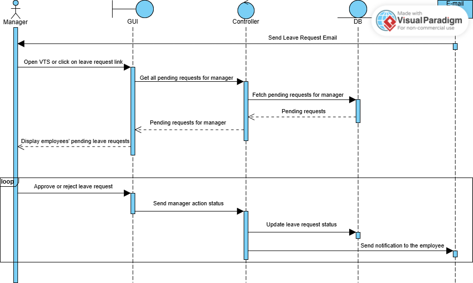
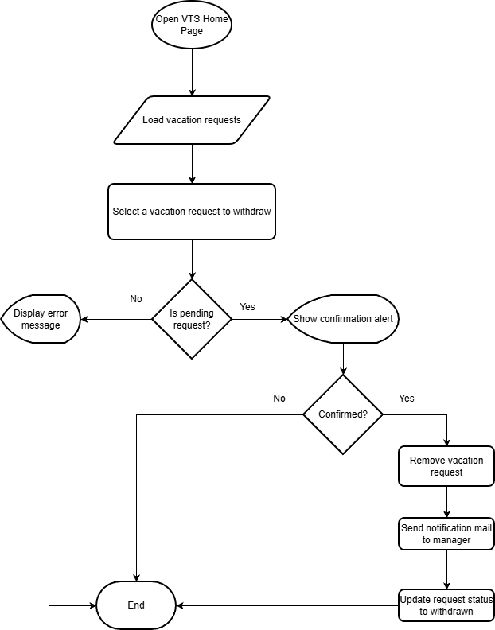
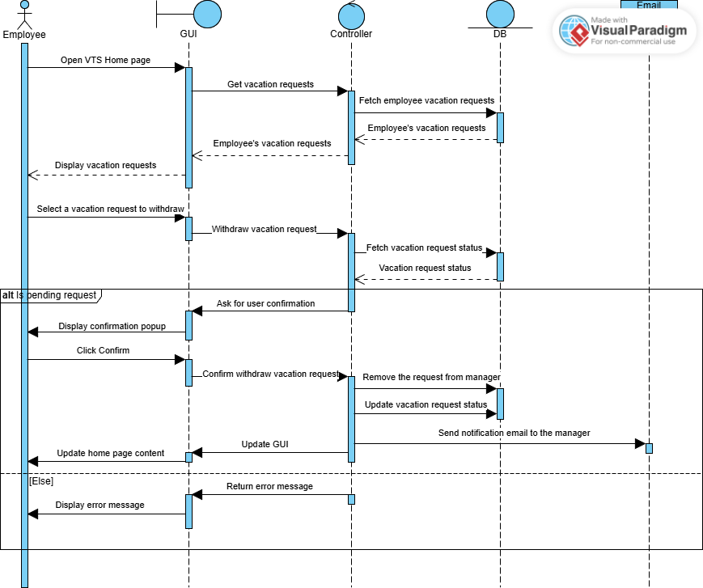

# Vacation-Tracking-System (VTS)
This repo consists of system analaysis diagrams for a Vacation Tracking System

## 1- Vision
For many businesses today, there are a lot of challenges for managers to manage their employees’ time and vacations because of their increasing independence and the fact that they can work on multiple projects across different time zones.

To address this problem, we need to create a **Vacation Tracking System (VTS)** to facilitate managing employees’ vacations and ensure it can be extended to integrate with other systems.

The **VTS** will provide employees with capabilities to manage their own vacation time, sick leave, and personal time off, without needing to be experts in company or local facility leave policies.

---

## 2- Functional Requirements

- The system should have **flexible user authorization** with different rules for validating and verifying leave time requests.  
- The system should **support manager approval** if required.  
- The system should **provide access to requests** for the previous calendar year and allow requests to be made **up to 18 months in the future**.  
- The system should have a **notification system** using e-mail to:
  - Request manager approval.
  - Notify employees of request status changes.  
- The system should have a **log system** that keeps records of all transactions.  
- The system should **provide a Web service** as an integration gateway between VTS and other internal systems.  
- The system should **allow HR and system administrators** to override any actions.  
- The system should **allow managers** to directly award personal leave time (within system-set limits).  
- The employee should be able to:
  - View vacation time requests.
  - Create new requests.
  - Cancel existing vacation time requests.

---

## 3- Non-Functional Requirements

- The system should be **easy to use**, with a **user-friendly interface**.  
- The system should **use existing hardware and middleware**.  
- The system should be implemented as an **extension to the existing intranet portal system** and should use the portal’s **single sign-on (SSO)** for authentication.  
- The system should be a **Web application**, extending the organization’s existing intranet to provide a **convenient and natural entry point** for users.

---

## 4- Constraints

- If an employee has **two different roles**, they must use **two different login IDs** to manage those roles.  
- The system must be **compatible with existing hardware**.  
- The system must be **accessible through the internal network only**.

---

## 5- Assumptions

The **Vacation Tracking System (VTS)** is not expected to be a heavily used application.  
It will primarily serve approximately **2,000 company employees** and will utilize the organization’s **existing hardware infrastructure**.  

However, since the system will also be integrated with other internal applications, the following considerations should be applied:

- The system should be **designed for easy integration** with any other internal system.
- The system should be **capable of handling approximately 300–500 concurrent requests**, which will be sufficient for the expected load.

---

## 6- Actors

### 1. Employee
The main user of the system. An employee uses VTS to manage their vacation time, including viewing, creating, and canceling vacation requests.

### 2. Manager
A manager has all the capabilities of a regular employee but also:
- Approves vacation requests from direct subordinates.
- Can award subordinates compensatory (comp) time, within system-defined limits.

### 3. Clerk
A member of the HR department responsible for ensuring employee information across HR systems is accurate and up to date.  
The HR clerk can **add or remove records** and has sufficient rights to **view personal data**.  
If the clerk is also an employee, they must use **separate login IDs** for each role.

### 4. System Administrator
Responsible for:
- The smooth operation of system technical resources (e.g., web server, database).
- Collecting and archiving all **system log files**.

---

## 7- Manage Time Use Case

### 7.1- Flowchart Diagram


### 7.2- Sequence Diagram

#### 7.2.1- Employee Sequence Diagram



#### 7.2.2- Manager Sequence Diagram



### 7.3- ER Diagram


### 7.4- Pseudocode

```code
Function createLeaveRequest() {
    var vacationType = getVacationType();
    var vacationHours = getHours()
    var vacationStartDate = getStartDate();
    var vacationEndDate = getEndDate();
    var EmployeeID = getEmployeeID();
    
    return new LeaveRequest(vacationType, vacationHours, vacationStartDate, vacationEndDate, EmployeeID)
}

Function manageTime(LeaveRequest request) {
    if(isNotValid(request)) {
        error = IN_VALID_REASON;
        return CREATE_REQUEST_FORM;
    }
    
    if(isManagerApprovalRequired(request)) {
        sendEmailToManager(request);
    }
    
    return HOME_PAGE;
}

Function managerController() {
    List pendingRequestsList = getPendingRequests();
    foreach (request : pendingRequestsList) {
        makeRequestDecision(request);
        updateRequestStatus(request);
        notifyRequestOwner(request);
    }
    return HOME_PAGE;
}
```

---

## 8- Withdraw request use-case

### 8.1- Flowchart Diagram



### 8.2- Sequence Diagram



### 8.3- Pseudocode

```code
Function withdrawVacationRequest(VacationRequest request) {
    var requestID = getRequestID(request);
    var EmployeeID = getEmployeeID(request);
    
    if(!isRequestOwnedByEmployee(requestID, EmployeeID)) {
        return NOT_OWNER_ERROR;
    }
    
    if(!isRequestWithdrawable(requestID)) {
        return NOT_WITHDRAWABLE_ERROR;
    }
    
    withdrawRequest(requestID);
    updateRequestStatus(requestID);
    notifyManagerOfWithdrawal(requestID);
}
```

---